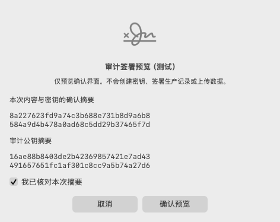
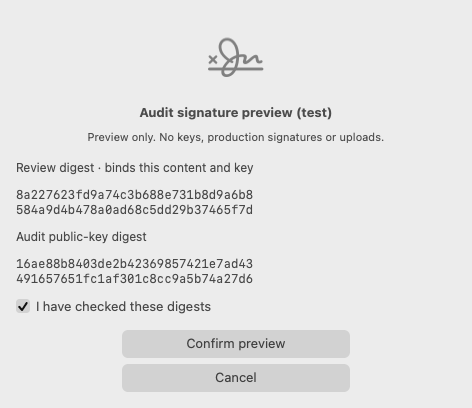

# Native audit owner review — local component acceptance

Implementation revision: `becedf4c88301de97e2fcd294aa15a362428b54f`.
Date: 2026-09-07. Not an installed app, production signer or release approval.

Verified locally:

-14preflight +38signing-session +10owner-review/provider cases passed.
-Chinese/English AppKit controls and real modal tests passed: Escape cancels,
  checked preview confirmation still returns false; no Return-default signature.
-Thread Sanitizer build/run of owner-review/provider tests passed10cases without
  a race report. Hardware operations were fake contexts; real test ECDSA used
  fixed synthetic software keys in memory only.
-Serial native runner, default sensitive logging mutation contract, static
  privacy audit, audit source-scope and runtime-block checks passed. Final
  bilingual render-output extension was rerun with UI tests and logging scan.
-Independent review found a P2 deadline gap, then approved after its regression
  and correction. Full operation now shares a bounded deadline, invalidates once
  and suppresses late signatures; an already-started OS operation cannot be undone.
-No App, Sources, Package.swift, Infrastructure, native preflight entrypoint or
  production release gate changes relative90679e1.

Render evidence comes from the actual native view, with its standard window
background, not a design mock. It shows the checked test-preview state:





Native layout findings: NSAlert requires an accessory frame, not merely intrinsic
stack size; its layout/default-cell handling rewrites key equivalents. Explicit
accessory sizing and post-layout safe-key configuration are covered by tests.

Reproduce from repository root:

```sh
bash Scripts/test-audit-owner-preflight.sh
bash Scripts/test-sensitive-logging-contract.sh
bash Scripts/audit-privacy.sh --static-only
bash Scripts/test-privacy-audit-contract.sh
```

Run serially: mutation tests intentionally insert temporary leaking source.
Requires a macOS GUI session for modal tests. No native key is loaded/generated
and no real authentication is requested by the tests.

Remaining: dedicated wrapped-key storage and enrollment/revocation, signed helper
identity and its access policy, live hardware prompt/timeout/cancellation tests,
semantic evidence validation, restricted collector and production evidence.
